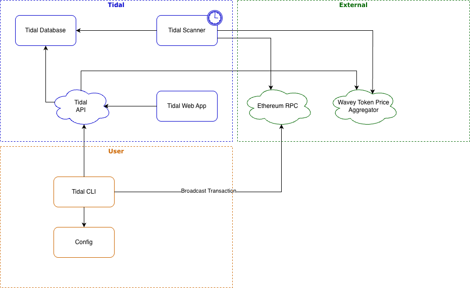

### Scanner
- scheduled background job designed to periodically refresh db
- currently runs every 15 minutes
- discovers vaults, strategies and tokens
- supports sources: strategies, configure fee burners
- checks balances, prices tokens
- Transaction support:
    - ✅ auto-settles active auctions with 0 balance
    - ☑️ auto kick auctions
    
### UI
- requires auction v1.0.4
- displays data for all sources
- integrated links to auctionscan.info

### CLI
- client for managing and interacting with auctions
- available to anyone with an api key issued by wavey
- `tidal kick run --broadcast`
- `tidal auction settle [0xauction] --sweep --broadcast`
- Sweep and settle
	 
### API
- serves the UI and the CLI
- CLI-driven actions are authenticated and require an api key

